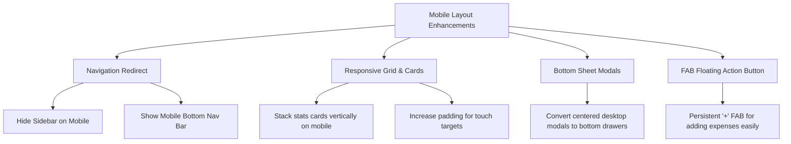

# Nexora Frontend Specifications

This document outlines the current technical stack, architecture, core features, and the proposed mobile UI/UX enhancements required to transform **Nexora** into a world-class, daily-usable mobile application.

---

## 🛠️ Current Technology Stack

Nexora is built using modern frontend technologies optimized for speed, simplicity, and flexibility:

| Technology | Version / Package | Purpose |
| :--- | :--- | :--- |
| **Core Framework** | React `^19.2.4` | Component-based UI engine. |
| **Build System** | Vite `^8.0.0` | Fast dev server and bundling. |
| **Styling** | Tailwind CSS `^3.4.17` | Utility-first styling framework. |
| **Authentication** | `@react-oauth/google` `^0.13.4` | Secure Google Sign-in integration. |
| **Assets/Fonts** | Google Fonts (Manrope, Space Grotesk) | Elegant sans-serif typography for readable dashboards. |

---

## 🏗️ Architecture & Component Map

The application logic is concentrated in a highly unified structure:
* **Entry Point**: [main.jsx](file:///Users/raj.v.soni/GITHUB/Nexora_frontend/src/main.jsx) handles strict mode, error boundaries, and provides the Google OAuth context.
* **Core Application**: [App.jsx](file:///Users/raj.v.soni/GITHUB/Nexora_frontend/src/App.jsx) is a comprehensive engine containing all state management, modal logic, utility functions, and the primary app shell views.
* **Global Styles**: [index.css](file:///Users/raj.v.soni/GITHUB/Nexora_frontend/src/index.css) loads custom fonts and applies base CSS rules.

---

## 🚀 Key Features Implemented

1. **User Authentication**:
   * Traditional email/password screen.
   * One-click Google Login.
2. **Group Management**:
   * Group creation (name, description, category, currency type).
   * Joining existing groups instantly via custom invite links.
3. **Expense Splitting engine**:
   * Split calculations (Equally, Exact amounts, Percentages, and Item-wise).
   * Smart Category inference (Auto-tags based on description).
4. **Smart Expense Inputs (OCR & AI)**:
   * **Text parsing**: Auto-extracts amounts, descriptions, and users from plain text inputs.
   * **Voice Capture**: Utilizes browser Speech Recognition to record and parse expenses hands-free.
   * **Receipt OCR Scanner**: Uploads receipt images to extract individual items, tax, and costs.
5. **Debt Settlements**:
   * Automated debt simplification calculation (minimized transactions).
   * Cash payment settlements.
   * UPI redirects (direct payment flow via standard UPI apps).
   * Dynamic QR Code Generator for easy desktop-to-mobile scanning.
6. **Profile Customization**:
   * Display name editing, profile updates, and setting UPI ID for receiving payments.

---

## 📱 The Mobile Experience: Current Gaps

While the desktop interface works exceptionally well, the mobile view requires critical adjustments to achieve native-app quality:

### 1. Sidebar Space Hogging
* **Problem**: The navigation sidebar ([App.jsx:L1675-1733](file:///Users/raj.v.soni/GITHUB/Nexora_frontend/src/App.jsx#L1675-L1733)) has a fixed width (`w-64`) and is always visible. On mobile screens, this eats up more than 60% of the horizontal space, making the dashboard and charts completely squished and unusable.
* **Goal**: Implement a responsive sidebar that collapses into a **bottom navigation bar** or a slide-out hamburger menu drawer for mobile users.

### 2. Squished Stat Cards Grid
* **Problem**: The group balances summary cards ([App.jsx:L1765-1780](file:///Users/raj.v.soni/GITHUB/Nexora_frontend/src/App.jsx#L1765-L1780)) are locked in a 3-column grid (`grid-cols-3`).
* **Goal**: Transition to vertical stacking or a swipeable horizontal card deck on mobile screens using tailwind's responsive breakpoint prefixes (e.g., `grid-cols-1 md:grid-cols-3`).

### 3. Tight Headers & Action Buttons
* **Problem**: Group details and action buttons ("Add Expense" / "Settle Up") are placed side-by-side in the main header. On devices under 400px wide, this wraps and pushes content off-screen.
* **Goal**: On mobile viewports, the buttons should collapse into icon-only actions or become a **Floating Action Button (FAB)** in the bottom right corner.

### 4. Narrow Modal Windows
* **Problem**: Modals like expense creations and settlement details are centered desktop dialogs with fixed layouts.
* **Goal**: Implement mobile-optimized **bottom sheets** that drag up from the bottom of the viewport, matching premium iOS and Android design practices.

### 5. Touch Target Sizes
* **Problem**: Multi-payer checkmarks, inputs, and tab navigation buttons have small tap areas (under the standard `44x44px` mobile recommendation).
* **Goal**: Increase padding and button container heights for mobile layout.

---

## 🎨 Proposed Mobile UI/UX Enhancements

To make Nexora the ultimate daily-use utility, we propose implementing a **Mobile-First Design System Overlay**:



### 1. Navigation Restructure
* **Desktop**: Keep the elegant Left Sidebar.
* **Mobile**: Hide the sidebar completely (`hidden md:flex`). Introduce a sleek, glassmorphic **Bottom Navigation Bar** fixed at the bottom of the viewport with tabs: `Groups`, `Expenses`, `Balances`, `Profile`.

### 2. Layout & Typography Adaptation
* Utilize Tailwind responsive sizes:
  * Headers: `text-xl md:text-2xl`
  * Grid: `grid-cols-1 sm:grid-cols-2 md:grid-cols-3`
  * Container padding: `px-4 md:px-6`
* Ensure elements use `h-11` or `h-12` heights for input fields and buttons to make tapping effortless on touch screens.

### 3. Dynamic Modals (Desktop Modal vs Mobile Bottom-Sheet)
* Add custom responsive styles so standard modals slide up smoothly from the bottom on mobile viewports using touch gestures or clean transition keys:
  ```css
  /* Mobile Bottom Sheet CSS Pattern */
  @media (max-width: 768px) {
    .modal-container {
      margin-top: auto;
      border-bottom-left-radius: 0;
      border-bottom-right-radius: 0;
      border-top-left-radius: 24px;
      border-top-right-radius: 24px;
      width: 100%;
      max-width: 100%;
      animation: slide-up-sheet 0.3s cubic-bezier(0.16, 1, 0.3, 1);
    }
  }
  ```
